<p align="center">

</p>

<p align="center">
<a href="https://linkedin.com/in/deepaksriramk1904"></a>
<a href="https://github.com/Deepaksriramk"></a>
<a href="https://leetcode.com/u/Deepaksriram/"></a>
<a href="https://www.hackerrank.com/profile/sriram934596"></a>
<a href="https://x.com/SriRamKD1904"></a>
<a href="mailto:sriram934596@gmail.com"></a>
</p>


<h2 align="center">About Me</h2>

<p align="center">
Passionate B.Tech IT student with a strong foundation in <b>Full Stack Web Development</b>.<br>
I love building innovative, scalable solutions that solve real-world problems.<br>
Always learning, constantly growing, and open to exciting collaborations!
</p>

```ts
const deepaksriram = {
  name:       "Deepaksriram K",
  role:       "Full Stack Developer",
  location:   "Erode, Tamil Nadu, India",
  education:  "B.Tech Information Technology @ Nandha Engineering College",
  experience: "Software Developer Intern @ iGen Services and Solutions (May–Aug 2026)",
  stack:      ["React", "Node.js", "Express", "PostgreSQL", "MySQL"],
  learning:   ["Advanced DSA", "Flutter"],
  openTo:     ["Internships", "Collaborative projects", "Learning opportunities"],
  interests:  ["Innovative projects", "Team collaboration", "Team management"],
  goal:       "Ship impactful projects and keep a clean academic record",
};
```

<br>

<table align="center">
  <tr>
    <td align="center" width="25%" valign="top">
      <h3>🌐</h3>
      <b>Full Stack Web</b><br>
      <sub>End-to-end apps with React, Node.js and databases. Responsive, interactive UIs.</sub>
    </td>
    <td align="center" width="25%" valign="top">
      <h3>🧠</h3>
      <b>Data Structures &amp; Algorithms</b><br>
      <sub>Solving complex problems with optimized solutions.</sub>
    </td>
    <td align="center" width="25%" valign="top">
      <h3>🗄️</h3>
      <b>SQL &amp; Database Design</b><br>
      <sub>Efficient data modeling and query optimization.</sub>
    </td>
    <td align="center" width="25%" valign="top">
      <h3>📱</h3>
      <b>Mobile Development</b><br>
      <sub>Exploring Flutter for cross-platform applications.</sub>
    </td>
  </tr>
</table>


<h2 align="center">Journey</h2>

<div align="center">

| When | What | Where |
|:-----|:-----|:------|
| **May – Aug 2026** | Software Developer Intern | iGen Services and Solutions Pvt. Ltd., Erode |
| **Present** | B.Tech, Information Technology | Nandha Engineering College, Erode | |

</div>


<h2 align="center">Tech Stack</h2>

<div align="center">

| Area | Technologies |
|:--|:--|
| **Frontend** |  |
| **Backend** |  |
| **Databases** |  |
| **Tools** |  |

</div>


<h2 align="center">Featured Work</h2>

<h3 align="center">Major Projects</h3>

<table>
<tr>
<td width="30%" valign="top">

#### 🏥 Digitalized Patients Management System
**Physiotherapy Hospital**

<br>
<sub>+ PDF reports</sub>

</td>
<td valign="top">

**Features**
- Complete patient registration and profile management
- Treatment plan creation and progress tracking
- Billing and invoice generation with payment tracking
- Therapist performance analytics and workload management
- Real-time appointment notifications
- Prescription management and downloadable reports
- Role-based access control (Admin, Doctor, Therapist)

**Impact**
- Reduced patient management overhead by 60%
- Enabled seamless therapist-patient communication
- Automated billing reduced processing time by 80%

</td>
</tr>
</table>

<table>
<tr>
<td width="30%" valign="top">

#### 🏢 Employee Management System
**iGen Services and Solutions**

<br>
<sub>+ Google Drive storage</sub>

</td>
<td valign="top">

**Features**
- Stores employee details acquired by I-GEN
- Employee CRUD operations
- File storage via Google Drive

**Impact**
- Integrated enterprise-level authentication and cloud storage

</td>
</tr>
</table>

<h3 align="center">Mini Projects</h3>

<table>
<tr>
<td width="33%" valign="top">

#### 🗺️ Wandr
**Travel Destination Explorer**

<br>
<sub>+ Leaflet Maps · OpenWeatherMap API · Unsplash</sub>

- Interactive maps and real-time weather
- Destination recommendations
- Responsive design

**Impact:** full-stack app with multiple third-party API integrations

</td>
<td width="33%" valign="top">

#### ♻️ YOLOv8 Waste Detection
**Detection and Quantification System**

<br>
<sub>+ YOLOv8 · OpenCV · Computer Vision</sub>

- Real-time waste detection
- Quantification across pollution scenarios
- Simulation results

**Impact:** implemented an advanced ML model for environmental monitoring

</td>
<td width="33%" valign="top">

#### ✨ Portfolio Website
**Personal brand site**

<br>
<sub>+ Framer Motion</sub>

- Glassmorphism design and smooth animations
- Dark mode
- ATS-optimized resume

**Showcase:** professional personal brand with modern web technologies

</td>
</tr>
</table>


<h2 align="center">Coding Activity</h2>

<p align="center">
  <a href="https://leetcode.com/u/Deepaksriram/"></a>
</p>


<h2 align="center">Let's Connect</h2>

<p align="center">
  <a href="https://github.com/Deepaksriramk/Deepaksriramk/raw/main/Deepaksriram.pdf"></a>
</p>

<p align="center">
  📍 Erode, Tamil Nadu &nbsp;·&nbsp; ✉️ <a href="mailto:sriram934596@gmail.com">sriram934596@gmail.com</a>
</p>

<br>


